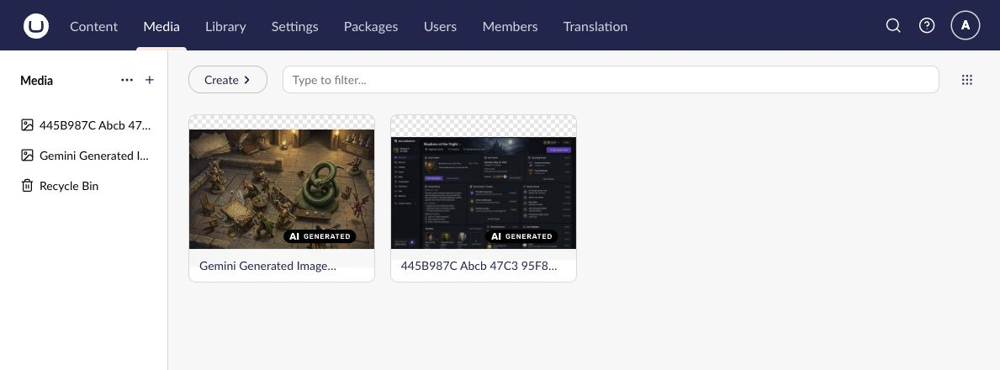

<p align="center">
  
</p>

<h1 align="center">AI Image Disclosure for Umbraco</h1>

<p align="center">Classify AI-generated and AI-modified images from signed C2PA Content Credentials.</p>

<p align="center">
  <a href="https://www.nuget.org/packages/TheBuilder.AIImageDisclosure"></a>
  <a href="LICENSE"></a>
</p>



AI Image Disclosure reads signed C2PA Content Credentials when an Umbraco Image is saved. It stores a small, stable classification that editors and frontends can rely on, while preserving manual control when provenance is absent or incomplete.

## What it adds

The package adds three properties to the default Image media type:

- `aiDisclosure`: empty when unknown, `generated`, or `modified`.
- `aiGenerator`: the software agent named by the manifest, when available.
- `aiDisclosureSource`: `C2PA` or `Manual`, so an editor override survives later file replacements.

The Media library overlays the matching European Commission disclosure badge on classified image thumbnails. Undetermined images and other media stay unchanged. Public sites decide where and how to render their own label.

## Install

AI Image Disclosure supports Umbraco CMS 17.1 through 18.x on .NET 10.

```sh
dotnet add package TheBuilder.AIImageDisclosure
```

Restart the application after installation. The package creates the **AI image disclosure** data type and adds all three properties to the default Image media type. Uploading or replacing an image runs detection when that media item is saved.

Editors can override the disclosure. This matters because metadata is easy to remove and many AI tools do not emit Content Credentials.

## Classification policy

Only C2PA manifests whose validation state is `Valid` or `Trusted` are considered. The package follows the active manifest and its parent ingredients, then applies these rules:

| C2PA evidence | Stored disclosure |
| --- | --- |
| `c2pa.created` with IPTC `trainedAlgorithmicMedia` | `generated` |
| `c2pa.edited` with an AI source type | `modified` |
| IPTC `compositeWithTrainedAlgorithmicMedia` | `modified` |
| No usable manifest or no positive AI evidence | Empty, meaning unknown |
| Invalid or unreadable C2PA data | Existing manual values are preserved |

Composite evidence takes precedence. An image created entirely by AI and then edited without a composite source remains `generated`; an AI edit signal without that creation evidence is `modified`. The parser also recognizes the `compositedWithTrainedAlgorithmicMedia` spelling used in some C2PA guidance.

A missing disclosure never means that an image is human-made.

Detection is bounded: images over 64 MiB, extracted manifest JSON over 4 MiB, and manifest stores over 1,024 claims are left undetermined for manual classification. Detection failures never block a media save.

## Delivery API

When Umbraco's media Delivery API is enabled, request the properties as normal media properties:

```http
GET /umbraco/delivery/api/v2/media/item/{mediaId}?expand=properties[$all]&fields=properties[aiDisclosure,aiGenerator,aiDisclosureSource]
```

Render the public label from `aiDisclosure`. Treat an empty value as not determined, not as proof that an image is not AI-generated.

## Detection boundaries

C2PA is the primary signal because it can carry signed provenance and a standardized digital source type. Potential complementary signals include:

- C2PA 2.4 `c2pa.ai-disclosure` assertions for more detailed model and training disclosures.
- Vendor watermark detectors such as SynthID when a supported provider exposes a verification service.
- XMP or EXIF software tags as a weak hint only. They are unsigned and easy to edit.

Pixel-based AI detector models should not set the disclosure automatically. Their false-positive and false-negative behavior makes them more suitable for an editor warning or review queue.

## Platform support

The pinned `ContentAuthenticity` dependency bundles native C2PA binaries for Windows x64 and Arm64, Linux x64 and Arm64, and macOS Arm64. Intel macOS is not included by that dependency release. Restoring the native dependency and publishing the host uses more disk space than a managed-only Umbraco package.

## Documentation

Read the complete documentation at [ai-image-disclosure.thebuilder.dk](https://ai-image-disclosure.thebuilder.dk/overview).

## Development

```sh
dotnet test TheBuilder.AIImageDisclosure.slnx
dotnet build samples/TheBuilder.AIImageDisclosure.Example/TheBuilder.AIImageDisclosure.Example.csproj
dotnet pack src/TheBuilder.AIImageDisclosure/TheBuilder.AIImageDisclosure.csproj --configuration Release
pnpm docs:dev
```

The integration suite contains a generated OpenAI PNG with embedded Content Credentials and a supplied Google manifest chain.

## License

MIT. See [LICENSE](LICENSE) and [THIRD-PARTY-NOTICES.md](THIRD-PARTY-NOTICES.md).
