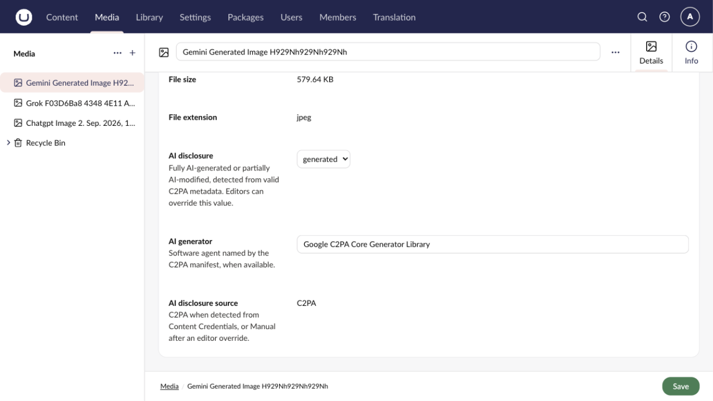

## Requirements

- Umbraco CMS 17.1 through 18.x
- .NET 10
- A supported native platform listed under [Operations](/operations)

## Install

```sh
dotnet add package TheBuilder.AIImageDisclosure
```

Restart the application. On first startup, the package creates the **AI image disclosure** data type and adds its properties to the default Image media type.

## Test an image

1. Open the **Media** section.
2. Upload an image with signed C2PA Content Credentials.
3. Save the media item.
4. Check **AI disclosure**, **AI generator**, and **AI disclosure source**.
5. Return to the Media collection and confirm the badge appears on the thumbnail.

Detection runs when an image file is uploaded or replaced. A detection failure never blocks the media save.



## Set a manual value

Select **Fully AI-generated** or **Partially AI-modified** in the disclosure property, then save. The source changes to `Manual` so later file processing does not silently replace the editor's decision.

Clear the selection when the classification is unknown. Do not use an empty value to assert that an image is human-made.
